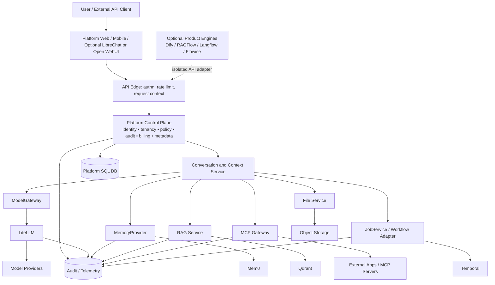
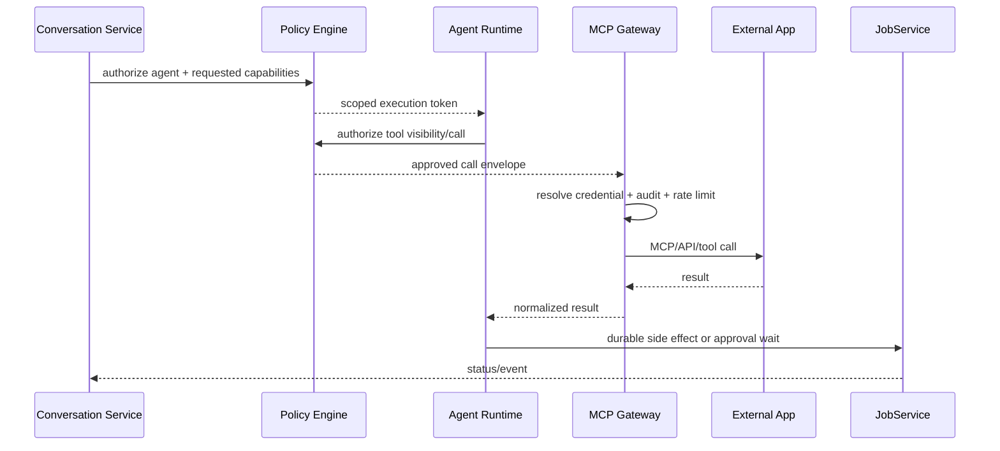

# Wave D — Target Architecture Blueprint

**Date:** 2026-09-11  
**Status:** Architecture analysis; no production implementation.  
**Evidence posture:** Every conclusion is labelled FACT, INFERENCE, or UNKNOWN. Candidate repositories remain unmodified.

## 1. Architectural thesis

**Recommendation:** Build a platform-owned control plane around replaceable engines and infrastructure services. Use LibreChat as the initial chat/agent shell where useful, LiteLLM for model access, Mem0 for long-term memory, a platform RAG service over Qdrant, the MCP Python SDK behind a platform gateway, and Temporal for durable workflows.

- **FACT:** Wave C.5 concludes no audited product is safe as-is for a commercial multi-user platform; commercial capabilities are closed, absent, unsafe-by-default, or distributed ([`reconciliation-summary-C5.md`](../reports/audit/reconciliation-summary-C5.md:159)).
- **INFERENCE:** A product-plane/control-plane split minimizes rewrite and prevents any candidate’s tenant, billing, or schema model from becoming irreversible.
- **UNKNOWN:** Load, cost, failover, and migration benchmarks were not executed.

## 2. System context



**Boundary rule:** candidate products never write platform SQL, Qdrant collections, Mem0 identity filters, LiteLLM management tables, or Temporal persistence directly. They receive scoped APIs and correlation context.

## 3. Platform-owned control plane

### 3.1 Identity and tenancy

**Platform owns:** users, service principals, organizations/tenants, workspaces, projects, memberships, roles, policy bindings, API keys, OAuth connection references, session/device records, and tenant lifecycle.

- **FACT:** All audited candidates have incomplete or distributed commercial tenancy; LibreChat’s strict tenant mechanism is opt-in, Dify’s commercial RBAC is closed, LobeChat’s business modules are stubs, and Open WebUI lacks a universal tenant primitive ([`audit-summary-C.md`](../reports/audit/audit-summary-C.md:60)).
- **INFERENCE:** Identity must terminate at the platform edge and be represented by a signed internal request context.
- **UNKNOWN:** Choice of IdP and exact token protocol is a product decision.

```text
RequestContext {
  request_id, trace_id,
  principal_id, principal_type,
  tenant_id, workspace_id, project_id,
  roles, policy_version,
  consent_version, data_residency,
  auth_time, deadline,
  capabilities, idempotency_key
}
```

The context is server-derived, signed or mTLS-authenticated between services, and never accepted solely from user-provided headers.

### 3.2 Authorization and policy

**Platform owns:** tenant/workspace/project membership, resource ACL, tool approval, model policy, data classification, retention, export, deletion, and service-to-service authorization. Candidate ACLs are defense-in-depth only.

**Recommendation record:**

- **Recommendation:** One platform policy decision point plus resource-level enforcement at each service boundary.
- **Direct evidence:** LibreChat’s tenant plugin is strongest but default-off; Open WebUI AccessGrants are strong resource ACLs but not tenancy; RAGFlow and Dify use distributed predicates ([`reconciliation-C5.md`](../evidence/reconciliation-C5.md:192)).
- **Alternatives:** Make LibreChat/Dify/RAGFlow authorization authoritative; database-only RLS; per-tenant deployment.
- **Why it wins:** Avoids duplicate policy planes while retaining local checks as defense-in-depth.
- **Modification cost:** MEDIUM for platform policy; HIGH to retrofit all engines.
- **Integration cost:** MEDIUM for signed context and policy checks.
- **Long-term maintenance:** MEDIUM.
- **Upgrade risk:** LOW at platform API; HIGH if engine authorization is patched.
- **Confidence:** HIGH.

### 3.3 Canonical product data

Platform SQL owns:

- tenant/workspace/project/membership/policy records;
- conversation, message, turn, attachment, citation, agent-run, tool-call, approval, and job metadata;
- canonical file/document metadata, versions, ownership, retention, and deletion state;
- memory consent, promotion decisions, provenance, and scope links;
- usage events, reservations, commits, refunds, quotas, invoices, and provider-cost reconciliation;
- integration registry, secret references, audit events, and migration mappings.

Engine databases are projections or private runtime state. Shared database integration is prohibited except through deliberate migration tooling.

## 4. Stable internal interfaces

The following interfaces are platform contracts, not candidate schemas.

### 4.1 `ModelGateway`

```text
complete(request: ModelRequest) -> ModelResponseStream
estimate(request: TokenEstimateRequest) -> TokenEstimate
listCapabilities(policy: ModelPolicy) -> ModelCapabilities
reserveUsage(request: UsageReservation) -> Reservation
commitUsage(reservation, observedUsage) -> UsageCommit
```

`ModelRequest` includes model alias, messages/context, tools, response mode, tenant/project context, request/deadline, idempotency key, and policy constraints. Response events normalize deltas, tool calls, usage, finish state, provider attempt, and errors.

- **Implementation:** LiteLLM via Level 1 HTTP/API initially; direct provider adapter remains an escape hatch.
- **Ownership:** Platform policy and ledger; LiteLLM routing/provider translation/retry/cost observation.

### 4.2 `MemoryProvider`

```text
add(scope, record, provenance, policy) -> MemoryId
search(scope, query, budget) -> MemoryRecord[]
get(scope, memory_id) -> MemoryRecord
update(scope, memory_id, patch) -> MemoryRecord
history(scope, memory_id) -> MemoryEvent[]
delete(scope, memory_id) -> DeleteReceipt
forget(scope, policy) -> DeleteReceipt
```

Scope is derived from authenticated context. It distinguishes `user`, `project`, `conversation`, `agent`, and `run`; it does not allow arbitrary raw filters.

- **Implementation:** Mem0 via Level 1/2.
- **Ownership:** Platform consent, policy, provenance, retention, and deletion; Mem0 extraction/search/update mechanics.

### 4.3 `RagProvider`

```text
ingest(document_version, source, extraction_policy) -> IngestionJob
getStatus(document_version) -> IngestionStatus
query(scope, query, retrieval_policy) -> CitationSet
delete(document_version) -> DeleteReceipt
reindex(document_version, embedding_version) -> IngestionJob
```

The interface returns citations with stable platform document/version/chunk IDs, source offsets, scores, and redaction metadata. It does not expose Qdrant collection names.

- **Implementation:** Platform RAG service over Qdrant; RAGFlow adapter is conditional.
- **Ownership:** Platform document metadata and authorization; RAG service parsing/chunking/embedding/citation; Qdrant points/payloads.

### 4.4 `McpGateway`

```text
registerServer(scope, manifest, credential_ref) -> ServerId
discoverTools(scope, server_id) -> ToolManifest[]
requestApproval(scope, tool_call) -> Approval
callTool(scope, tool_name, arguments, idempotency_key) -> ToolResult
revoke(scope, server_id/tool_id) -> Receipt
```

Every tool call is authorized independently; tool visibility is not authorization. The gateway applies policy, credential isolation, rate limits, data classification, audit, and execution timeout.

- **Implementation:** MCP Python SDK behind gateway; LobeChat/Open WebUI fail-closed patterns are references.
- **Ownership:** Platform registry, grants, secrets, approvals, audit, quotas; SDK protocol sessions/transports.

### 4.5 `JobService`

```text
start(job_type, input_ref, context, idempotency_key) -> JobId
signal(job_id, signal) -> Ack
cancel(job_id, reason) -> Ack
getStatus(job_id) -> JobStatus
subscribe(job_id) -> JobEventStream
```

Temporal is an execution engine. The platform owns job records, admission, authorization, idempotency, quota, business outputs, and user-visible status.

### 4.6 `ContextBudgetService`

```text
plan(input_set, model_capabilities, policy) -> ContextPlan
estimate(input_set, model) -> TokenBudget
proposeCondensation(context_id) -> CondensationProposal
approveCondensation(proposal_id, actor) -> ApprovedPlan
continue(context_id, plan_id) -> ContextContinuation
```

The service computes model-specific capacity, current usage, remaining tokens, priority ranking, warnings, compaction/summary proposals, memory promotion candidates, and continuation state. It must not silently delete user-visible content.

- **Reference:** LibreChat has token-counted pruning, remaining context, and compaction ([`deep-librechat.md`](../reports/forensic/deep-librechat.md:31)).
- **Platform addition:** cross-engine policy, user approval, persistent proposal state, and model capability registry.

## 5. Memory architecture

| Memory type | Canonical owner | Retrieval/write path | Notes |
|---|---|---|---|
| Conversation transcript | Platform conversation DB | Chat service | Immutable event history plus derived summaries |
| Short-term working context | Context service / agent run | Context plan | May be cached; never canonical long-term memory |
| User profile memory | Platform policy + Mem0 | `MemoryProvider` scope=user | Consent, edit, export, forget required |
| Project memory | Platform policy + Mem0 | scope=project | Membership-derived; never inferred from client filter |
| Episodic memory | Mem0 projection + platform provenance | scope=user/project/run | Retention and promotion are platform policy |
| Semantic memory | Mem0 projection or future engine | scope=user/project | Versioned extraction and embedding |
| Document knowledge | RAG service + Qdrant | document/project scope | Not mixed with personal memory namespace |
| Agent state | Agent runtime + platform run DB | `JobService`/agent state | Tool side effects require idempotency |

**Recommendation:** Treat Mem0 as replaceable memory engine, not memory authority. **Evidence:** Mem0’s lifecycle is strong but tenant authority is caller/filter-based ([`subsystem-mem0.md`](../reports/forensic/subsystem-mem0.md:27)). **Confidence:** HIGH.

## 6. Context-management architecture

```text
incoming turn
  → retrieve authorized conversation window
  → retrieve project/user memories under budget
  → retrieve RAG citations under budget
  → reserve model context capacity
  → rank: system policy > current turn > approved project facts > recent conversation > relevant memory > optional citations
  → expose used/remaining/model-limit telemetry
  → if over budget: propose trim/summary/memory promotion
  → await approval where content semantics change
  → persist context plan and continue/resume
```

**Failure rule:** Context exhaustion is not a billing failure. The service should return a structured `context_budget_exceeded` or approval-required event, not silently drop policy or user content.

## 7. RAG architecture

**Platform RAG service responsibilities:** MIME and source policy, parser selection, chunking, embedding version, document status, citations, redaction, deletion cascade, reindex, tenant/project filters, and ingestion job orchestration.

**Qdrant responsibilities:** vectors, point IDs, payload indexes, filtered query, WAL/segments, snapshots, and service-level RBAC. Qdrant collection names and payload schemas remain private to the adapter.

**RAGFlow role:** optional advanced parser/GraphRAG engine behind `RagProvider`; mandatory gateway authorization and endpoint allowlist until confirmed fixes are deployed. **FACT:** RAGFlow’s image and thumbnail endpoints have cross-tenant exposure findings ([`reconciliation-C5.md`](../evidence/reconciliation-C5.md:76)).

## 8. Agent, tool, and MCP architecture



**MCP policy:** fail closed when grants are absent; copy the verified Open WebUI per-call authorization pattern and LobeChat synced-manifest/default-deny share pattern as reference, not source dependency ([`reconciliation-C5.md`](../evidence/reconciliation-C5.md:278)).

**Agent runtime:** Start with LibreChat’s agent capabilities where appropriate, but place tool calls, approval, usage reservation, and durable side effects behind platform interfaces. Temporal workflows handle long-running or approval-dependent operations.

## 9. Files and object storage

Platform file service owns upload authorization, malware/classification checks, metadata, versioning, retention, signed URLs, quotas, and deletion receipts. Object storage owns bytes. RAG owns derived text/chunks/indexes. Candidate file stores are imported through migration adapters only.

No public preview bypass is accepted without explicit share-token policy, expiry, resource ACL, audit, and content-disposition rules. This addresses the known public-share exceptions in LibreChat/LobeChat and RAGFlow storage-read risks.

## 10. Usage, billing, quotas, and provider abstraction

**Platform ledger:** append-only usage events; reservation/commit/release/refund; provider cost; tenant/project allocation; model and tool usage; storage/vector/job units. Every external call has a correlation and idempotency key.

**LiteLLM:** provider routing, model fallback, spend observation, key-level defensive budgets. Its organization/team/project tables are not canonical platform tenants.

**Quota enforcement:** admission occurs before model/tool/job/ingestion work. Commit occurs after observed usage. Retries reuse the same reservation or create an explicit attempt event.

## 11. Deployment topology

```text
Public edge / API gateway
  ├─ Platform API + policy + conversation service (stateless replicas)
  ├─ Context service (stateless, model registry/cache)
  ├─ ModelGateway adapter ── LiteLLM ── provider networks
  ├─ Memory adapter ── Mem0 ── memory vector backend
  ├─ RAG service ── Qdrant cluster + object storage
  ├─ MCP gateway ── MCP SDK sessions ── external systems
  ├─ Job adapter ── Temporal frontend/history/matching ── workers
  ├─ Optional engine gateways ── LibreChat/Dify/RAGFlow/Open WebUI/Langflow
  ├─ Platform SQL / audit event store
  ├─ Redis/cache only for non-canonical acceleration and coordination
  └─ Object storage / backup / KMS / secret manager
```

**Trust boundaries:** public clients; platform API; engine gateways; model providers; memory/RAG data planes; MCP external systems; workflow workers; storage. Each boundary has authenticated service identity, scoped context, timeout, audit, and data classification.

## 12. Latency and failure budget principles

- Keep synchronous chat path to bounded calls: policy → context retrieval (parallel memory/RAG) → model gateway → stream.
- Move extraction, indexing, memory promotion, summaries, billing reconciliation, and deletion verification to Temporal jobs where user experience permits.
- Prevent retry multiplication across platform, LiteLLM, engines, and Temporal. One layer owns retry policy per operation class.
- Tool side effects, billing commits, memory writes, and deletion steps require idempotency or compensation.
- Degrade safely: unavailable memory means no long-term memory; unavailable RAG means explicit retrieval-unavailable status; unavailable model gateway means no provider call; policy service failure denies.

## 13. Observability and security

Every request and event carries `request_id`, `trace_id`, `tenant_id`, `workspace_id`, `project_id`, `principal_id`, `job_id`, `model_attempt_id`, `memory_operation_id`, `document_version_id`, and `tool_call_id` where applicable.

Platform observability owns cross-service audit, redaction, retention, SLOs, cost attribution, and security alerts. Candidate telemetry is attached as evidence, never treated as the canonical audit stream.

**Security requirements:** fail-closed missing context; no arbitrary collection/filter selection; secrets by reference; prompt/tool/data classification; encrypted stores; tenant-aware logs; deletion verification across SQL/object/vector/memory/workflow projections.

## 14. Responsibility map

| Capability | Platform | LibreChat | LiteLLM | Mem0 | RAG/Qdrant | MCP SDK/gateway | Temporal |
|---|---|---|---|---|---|---|---|
| Identity/tenant | **Own** | consume | consume scoped key | consume derived scope | consume derived scope | consume grants | namespace mapping only |
| Authorization/policy | **Own** | local defense | key/model defense | filter defense | payload filter defense | **Own tool policy** | admission mapping |
| Conversation | **Own** | shell/runtime projection | — | — | — | — | run reference |
| Provider routing | policy | call gateway | **Own engine** | optional extraction provider | optional embeddings | — | — |
| Long-term memory | policy/provenance | compatibility | — | **Own engine** | not owner | memory tool adapter | job trigger |
| Documents/RAG | metadata/policy | client seam | — | not owner | **Own service/index** | retrieval tool | ingestion workflow |
| Tools/MCP | policy/audit | agent UX | optional protocol paths | — | optional native tools | **Own runtime adapter** | durable execution |
| Jobs | semantics/status | local legacy jobs | retries only | no durable queue | ingestion tasks via adapter | session/event only | **Own execution engine** |
| Billing/quotas | **Own ledger** | legacy balance projection | defensive budgets | — | — | usage events | admission/status |
| Audit | **Own canonical** | emit | emit | emit | emit | **Own call audit** | emit |

## 15. Classification and build/reuse decisions

- **FOUNDATION:** Platform control plane; LibreChat only as conditional shell/fork candidate.
- **ORCHESTRATION ENGINE:** Temporal for durable execution; Dify/Langflow/Flowise conditional engines.
- **AGENT ENGINE:** LibreChat agent runtime as initial reuse candidate; platform policy wraps it.
- **MEMORY ENGINE:** Mem0.
- **RAG ENGINE:** Platform RAG service; RAGFlow specialized/conditional.
- **CHAT FRONTEND:** Platform frontend; LibreChat/Open WebUI/LobeChat optional shells.
- **BACKEND SERVICE:** Platform services plus adapters.
- **INTEGRATION LAYER:** MCP gateway using MCP Python SDK.
- **STORAGE LAYER:** Platform SQL/object storage; Qdrant vector layer.
- **SPECIALIZED COMPONENT:** RAGFlow parser/GraphRAG, LiteLLM provider handlers.
- **REFERENCE IMPLEMENTATION:** LobeChat MCP security, LibreChat context/tenant tests, Open WebUI AccessGrants.
- **DO NOT USE:** candidate commercial plane as canonical; shared database; unpatched RAGFlow exposure; Open WebUI fragile multitenancy; LobeChat default JWKS.

## 16. Major architectural risks

1. **Tenant context loss:** Highest cross-cutting risk; all external calls must carry signed derived context.
2. **Duplicate policy planes:** Platform policy must be authoritative; engine policies are defense-in-depth.
3. **Duplicate state:** No permanent dual ownership of conversations, memory, documents, budgets, or tool registry.
4. **Retry side effects:** LiteLLM and Temporal retries can multiply provider/tool/billing effects.
5. **RAG deletion drift:** SQL/object/vector/index projections require deletion receipts and reconciliation.
6. **MCP supply-chain risk:** External tool schemas and credentials require approval, sandboxing, and audit.
7. **Operational complexity:** Qdrant, Mem0, LiteLLM, and Temporal create a substantial stateful platform.
8. **Upgrade drift:** Protocol and provider APIs change; contract tests and versioned adapters are mandatory.
9. **Unverified engine behavior:** Langflow/Flowise and some candidate internals remain evidence-limited.

## 17. Final target architecture recommendation

Build the platform plane first. Integrate LibreChat through APIs as the initial chat/agent shell only where it accelerates product delivery. Make LiteLLM, Mem0, Qdrant, MCP SDK, and Temporal replaceable sidecars behind stable platform interfaces. Keep Dify, RAGFlow, Open WebUI, LobeChat, Flowise, and Langflow as isolated engines or references with no shared canonical database. This preserves replacement of providers, memory, vector backend, RAG engine, agent runtime, frontend, auth, object storage, billing, MCP runtime, and external connectors without rewriting the platform domain.
