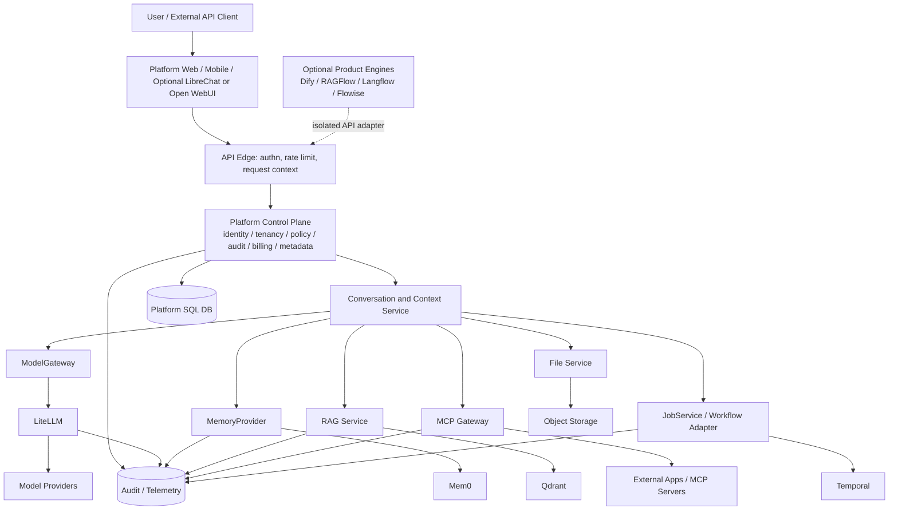

# Wave E — Final Research Package

**Date:** 2026-09-11 **Status:** Final deliverable (Wave E) — architecture analysis; no production code, no repository modifications, no invented evidence.

This document synthesizes all prior research waves (A1/A2/A3/B/C/C.5/D/E) into a single comprehensive deliverable with 29 sections in order. Each claim is labelled **FACT** (source-verified, file:line), **INFERENCE** (reasoned from evidence), or **UNKNOWN** (evidence unavailable). Evidence limitations are explicitly stated; no final decision relies on unverified claims.

---

## 1. Executive summary

*(Full executive summary in companion: [`executive-summary-E.md`](./executive-summary-E.md))*

**One-line conclusion:** Do not select a single open-source product as the commercial platform. Build a platform-owned control plane and compose replaceable engines behind stable internal interfaces.

**Key findings:**
- **No candidate is adoptable as-is:** LobeChat has 40+ business stubs + live forgeable JWKS key; Dify has closed enterprise RBAC + fail-open quota; RAGFlow has confirmed cross-tenant IDOR + dead credit schema; LibreChat's tenant isolation is default-off; Open WebUI has no tenant primitive.
- **Five subsystem candidates** (LiteLLM, Mem0, MCP Python SDK, Qdrant, Temporal) are replaceable engines/sidecars — not tenant or billing authorities.
- **Preferred composition:** Platform control plane (BUILD) + LiteLLM (INTEGRATE) + Mem0 (INTEGRATE) + platform RAG service over Qdrant (BUILD/INTEGRATE) + MCP SDK inside gateway (REUSE) + Temporal (INTEGRATE) + LibreChat as optional chat/agent shell (REUSE/WRAP).
- **Migration sequence:** Platform identity/contracts → model gateway → canonical conversations → memory → RAG → durable jobs → MCP → billing/quotas → engine evaluation → retirement.

---

## 2. Product requirements interpretation

The target platform is a **commercial, extensible, multi-user AI platform** with:
- **Personal AI:** persistent user memory, conversations, files, tools
- **Workspaces/projects:** team collaboration with project-specific memory, RAG, and access controls
- **RAG:** document ingestion, chunking, embedding, retrieval, citation management
- **Agents and workflows:** configurable agent runtime, tool execution, durable workflows
- **MCP/extensibility:** native MCP protocol support, tool marketplace, external integrations
- **APIs:** REST, streaming, OpenAI-compatible, API keys
- **Multi-tenancy:** tenant isolation, workspace membership, RBAC, billing, quotas
- **Replaceability:** model providers, memory engine, vector backend, RAG engine, agent runtime, frontend — all replaceable behind interfaces

**Architectural implications:** The platform must be a **product-plane + control-plane split**, not a single application. No upstream product provides all requirements in a safe, open, commercially usable form.

---

## 3. Candidate comparison matrix

*(Full matrix: [`candidate-matrix-E.md`](../comparison/candidate-matrix-E.md))*

### Score summary (0–5 × 16 dimensions, /80)

| Rank | Candidate | Total | Post-C.5 | Confidence |
|---:|---|---:|---:|---|
| 1 | LobeChat | 59 | 58 | HIGH — audited; business plane closed |
| 2 | LibreChat | 54 | 55 | HIGH — audited; strongest tenant mechanism |
| 3 | Dify | 51 | 51 | HIGH — audited; closed enterprise RBAC |
| 4 | Langflow ⚠ | 45 | — | LOW–MEDIUM — partial checkout |
| 4 | RAGFlow | 45 | 45 | HIGH — audited; best RAG, IDOR-breachable |
| 6 | Flowise | 44 | — | MEDIUM — triage, not re-audited |
| 7 | Open WebUI | 43 | 44 | HIGH — audited; no tenant primitive |
| 8 | Khoj | 41 | — | MEDIUM — triage, not re-audited |
| 9 | AnythingLLM | 40 | — | MEDIUM — triage, not re-audited |
| 10 | Letta ⚠ | U | — | N/A — source unavailable |

⚠ = evidence-limited. Langflow: incomplete Windows checkout. Letta: 12 non-implementation files in captured commit.

### Subsystem scores (A3 dimensions, 0–5)

| Subsystem | Modularity | API quality | Replaceability | Production readiness | Multi-tenancy | Extensibility | Ops complexity (↑=heavier) |
|---|---:|---:|---:|---:|---:|---:|---:|
| LiteLLM | 4 | 5 | 4 | 4 | 3 | 5 | 3 |
| Mem0 | 4 | 4 | 4 | 3 | 2 | 4 | 2 |
| MCP Python SDK | 5 | 4 | 5 | 4 | 1 | 5 | 2 |
| Qdrant | 4 | 5 | 4 | 5 | 3 | 3 | 4 |
| Temporal | 3 | 5 | 3 | 5 | 4 | 4 | **5** |

### Complexity (1–5, higher = more complex)

| Candidate | Score | Primary complexity sources |
|---|---|---|
| Dify | 4 | Dual permission regime; Celery sprawl; closed enterprise features |
| AnythingLLM | 3 | Single-container default; central provider/vector switches |
| LibreChat | 4 | Chat-pipeline monolith; FerretDB legacy; duplicate env reads |
| Open WebUI | 3 | 3043-line `main.py`; naming-convention multitenancy |
| Flowise | 3 | Process-local MCP state; distributed auth semantics |
| Langflow ⚠ | 4 | Compatibility alias layer; in-memory queue/cache |
| RAGFlow | 4 | Dead credit schema; per-process concurrency; monolithic services |
| Khoj | 3 | Django/FastAPI hybrid; no project tenancy |
| LobeChat | **5** | ~75-package monorepo; dual backend surfaces; stub indirection |

---

## 4. Individual repository report index

### Wave A1 — Four-repository triage reports
- [`triage-dify.md`](../reports/forensic/triage-dify.md) — Dify: first-class tenant/workspace, provider/plugin runtime, workflow/agent, RAG, MCP, Celery/Redis, quota/credit
- [`triage-librechat.md`](../reports/forensic/triage-librechat.md) — LibreChat: Mongo/Mongoose, explicit tenant plugin, memory, balances, agents, MCP, external RAG
- [`triage-open-webui.md`](../reports/forensic/triage-open-webui.md) — Open WebUI: FastAPI/SQLAlchemy, per-user memory, vector factory, OpenAI-compat, MCP
- [`triage-anythingllm.md`](../reports/forensic/triage-anythingllm.md) — AnythingLLM: Express/Prisma, workspace RAG, agents, MCP hypervisor, single-container default

### Wave A2 — Six-repository triage reports
- [`triage-ragflow.md`](../reports/forensic/triage-ragflow.md) — RAGFlow: strongest tenant model in A2, deep RAG pipeline, MCP, async tasks
- [`triage-lobechat.md`](../reports/forensic/triage-lobechat.md) — LobeChat: TypeScript monorepo, Next.js/Hono/tRPC, workspace-aware, MCP OAuth
- [`triage-langflow.md`](../reports/forensic/triage-langflow.md) — Langflow: Python/FastAPI, graph runtime, lfx SDK, provider bundles, partial checkout
- [`triage-flowise.md`](../reports/forensic/triage-flowise.md) — Flowise: Node/TypeScript pnpm monorepo, LangChain components, TypeORM, MCP
- [`triage-khoj.md`](../reports/forensic/triage-khoj.md) — Khoj: Django/FastAPI/pgvector, user memory, agents, tools, MCP, S3
- [`triage-letta.md`](../reports/forensic/triage-letta.md) — Letta: **source unavailable**; 12 tracked non-implementation files only

### Wave A3 — Subsystem reports
- [`subsystem-litellm.md`](../reports/forensic/subsystem-litellm.md) — LiteLLM: SDK/gateway, provider normalization, router/fallback, cost tracking
- [`subsystem-mem0.md`](../reports/forensic/subsystem-mem0.md) — Mem0: memory lifecycle (add/search/update/history/delete), scoped identities
- [`subsystem-mcp-python-sdk.md`](../reports/forensic/subsystem-mcp-python-sdk.md) — MCP Python SDK: protocol/transports/auth/extensions/EventStore
- [`subsystem-qdrant.md`](../reports/forensic/subsystem-qdrant.md) — Qdrant: typed vector/query/payload APIs, shards, WAL, RBAC
- [`subsystem-temporal.md`](../reports/forensic/subsystem-temporal.md) — Temporal: durable workflows, histories, task queues, retries, namespaces

### Wave B — Deep forensic reports
- [`deep-dify.md`](../reports/forensic/deep-dify.md) — Dify: LOGIN, CHAT, FILE, API traces; memory, RAG, agents, tenancy threading
- [`deep-librechat.md`](../reports/forensic/deep-librechat.md) — LibreChat: detailed traces + tenant plugin, memory, compaction, agent/MCP
- [`deep-open-webui.md`](../reports/forensic/deep-open-webui.md) — Open WebUI: FastAPI routes, memory, vector factory, MCP, function/tool
- [`deep-ragflow.md`](../reports/forensic/deep-ragflow.md) — RAGFlow: tenant domain, memory taxonomy, RAG pipeline, MCP host
- [`deep-lobechat.md`](../reports/forensic/deep-lobechat.md) — LobeChat: workspace auth, model runtime, MCP manifests, tool engineering
- [`deep-langflow.md`](../reports/forensic/deep-langflow.md) — Langflow: graph execution, build/stream/cancel, MCP, checkpoints

### Wave C — Audit reports
- [`audit-dify.md`](../reports/audit/audit-dify.md) — Dify independent audit: RBAC dual regime finding, quota cloud-gating
- [`audit-librechat.md`](../reports/audit/audit-librechat.md) — LibreChat audit: strict mode default-off; mechanism confirmed
- [`audit-ragflow.md`](../reports/audit/audit-ragflow.md) — RAGFlow audit: IDOR finding; credit dead code; per-process scaling
- [`audit-open-webui.md`](../reports/audit/audit-open-webui.md) — Open WebUI audit: no tenant primitive; fragile vector multitenancy
- [`audit-lobechat.md`](../reports/audit/audit-lobechat.md) — LobeChat audit: business stubs census; JWKS key liveness
- [`audit-summary-C.md`](../reports/audit/audit-summary-C.md) — composite audit summary with scores, red flags, disagreements
- [`disagreements-C.md`](../evidence/disagreements-C.md) — full disagreements register (17 items)

### Wave C.5 — Reconciliation
- [`reconciliation-C5.md`](../evidence/reconciliation-C5.md) — item-by-item evidence (9 items, all resolved)
- [`reconciliation-summary-C5.md`](../reports/audit/reconciliation-summary-C5.md) — C.5 composite impact summary

---

## 5. Architecture diagrams/index

### Target blueprint (from [`target-blueprint-D.md`](../architecture/target-blueprint-D.md) §2)



### Boundary rule
Candidate products never write platform SQL, Qdrant collections, Mem0 identity filters, LiteLLM management tables, or Temporal persistence directly. They receive scoped APIs and correlation context.

---

## 6. Execution-flow analysis

### Chat execution path

```text
User → API Edge (authn/rate-limit) → Platform Control Plane (scope/policy)
  → Conversation Service (retrieve authorized window)
  → Context Budget Service (model capacity, used/remaining, priority)
  → ModelGateway → LiteLLM → Provider (model call with authorized tools/context)
  ↔ MemoryProvider → Mem0 (scope-derived memory retrieval under budget)
  ↔ RagProvider → Qdrant (tenant-filtered citation retrieval under budget)
  ↔ McpGateway (per-call tool authorization, credential resolution, execution)
  → Response stream + usage commit + audit event
```

### File ingestion path

```text
Upload → File Service (auth, malware/class, metadata, signed URL, quota check)
  → Object Storage (bytes)
  → Temporal job → parser/chunker/embedder
  → Qdrant (tenant-scoped points with filterable payload)
  → platform document/citation metadata
```

### Agent execution path

```text
User → Conversation Service → Agent Runtime (LibreChat-compatible adapter)
  → Policy Engine (authorize agent + requested capabilities)
  → ModelGateway for LLM calls
  → McpGateway (tool authorization per call)
  → MemoryProvider (agent-scoped memory context)
  → JobService → Temporal (durable side effects, approval waits)
```

**Key principles:**
- Memory/RAG/tool retrieval happens **under budget** — each source competes for context capacity, not independently.
- No engine can silently discard or promote content; `ContextBudgetService` must approve condensation.
- Every external call carries `request_id`, `trace_id`, `tenant_id`, `principal_id`, and `idempotency_key`.

---

## 7. Memory comparison

| Memory type | Canonical owner | Retrieval/write path | Notes |
|---|---|---|---|
| Conversation transcript | Platform conversation DB | Chat service | Immutable event history + derived summaries |
| Short-term working context | Context service / agent run | Context plan | May be cached; never canonical long-term memory |
| User profile memory | Platform policy + Mem0 | `MemoryProvider` scope=user | Consent, edit, export, forget required |
| Project memory | Platform policy + Mem0 | scope=project | Membership-derived; never inferred from client filter |
| Episodic memory | Mem0 projection + platform provenance | scope=user/project/run | Retention and promotion are platform policy |
| Semantic memory | Mem0 projection or future engine | scope=user/project | Versioned extraction and embedding |
| Document knowledge | RAG service + Qdrant | document/project scope | Not mixed with personal memory namespace |
| Agent state | Agent runtime + platform run DB | `JobService`/agent state | Tool side effects require idempotency |

**Best candidate memory taxonomy:** RAGFlow (raw/semantic/episodic/procedural with extraction, tenant LLM, forgetting policy) — reference for ontological design only. **Do not dual-write** (rejected combination: LibreChat+Mem0 with dual writes).

---

## 8. Context-management comparison

*(Full comparison: [`capability-comparison-E.md`](../comparison/capability-comparison-E.md) §2)*

**LibreChat is the strongest reference:** token-counted pruning, remaining-context budget, compaction support, historical-file authorization. No candidate has a complete cross-engine context-budget service with user approval.

**Platform recommendation:** Build `ContextBudgetService` with:
- Model-specific capacity registry
- Current/remaining usage telemetry
- Priority ranking (system > current turn > approved facts > recent conversation > relevant memory > optional citations)
- User-approved condensation with provenance
- Memory promotion candidates
- Continuation after compression
- **Fail rule:** Context exhaustion is not a billing failure; return structured `context_budget_exceeded` or approval-required event.

---

## 9. RAG comparison

| RAG dimension | LibreChat (cleanest seam) | Open WebUI (best backend breadth) | RAGFlow (most integrated) | Qdrant (recommended vector backend) |
|---|---|---|---|---|
| Replaceability | **Strongest**: external HTTP `rag_api` | Strong: 10-backend vector factory | Most integrated — not replaceable wholesale | Infrastructure layer; replaceable behind adapter |
| Multitenancy | External (seam is clean) | Fragile naming-convention mapping | Per-tenant index naming (IDOR excepted) | Native `tenant_id` payload field with `is_tenant=True` index |
| Security risk | None verified | Self-documented "HUGE DATA CORRUPTION" risk in milvus mode | **Confirmed IDOR** at images/thumbnails | None (service-level RBAC only) |

**Platform recommendation:** Build platform RAG service over Qdrant. Use LibreChat's `rag_api` as compatibility adapter. RAGFlow only behind a security gateway with endpoint allowlist.

---

## 10. Agent/workflow comparison

| Agent dimension | LibreChat | Dify | Langflow/Flowise | LobeChat | Temporal (subsystem) |
|---|---|---|---|---|---|
| Durable state | Checkpoints, queued/resumable | Workflow/agent persistence | Graph flow runtime | Tool manifests, model runtime | Durable histories, retries, namespaces |
| MCP | OAuth, registry, cache | Native MCP | MCP endpoints/nodes | **Best**: synced manifests, default-deny | Not applicable |
| Workflow engine | None (agent only) | **Fact**: durable workflow schemas | **Fact**: graph execution is the core | None (agent only) | **Fact**: dedicated engine |

**Platform recommendation:** Start with LibreChat agent runtime through adapter; wrap tool calls/approval/usage in platform interfaces. Use Temporal for durable business workflows. Langflow/Flowise are conditional orchestration experiments.

---

## 11. MCP/integration comparison

| MCP dimension | LobeChat (reference) | Open WebUI (fail-closed) | LibreChat | RAGFlow |
|---|---|---|---|---|
| Tool listing auth | Synced-manifest, optional approval | **Fail-closed**: admin-only when no grants | Agent-level | MCP tools fetched; no verified call-time gating |
| Per-call auth | Agent runtime | `has_connection_access` fail-closed | Per-message agent path | UNKNOWN |
| Share-gate default-deny | **Yes** (`spendGate.ts`) | Resource ACLs | Share middleware | UNKNOWN |

**Platform recommendation:** Platform MCP gateway owns registry, grants, credentials, approvals, audit, rate limits. Copy LobeChat's default-deny share gate and Open WebUI's fail-closed per-call auth as design references. Use MCP Python SDK for protocol transport.

---

## 12. Multi-tenancy comparison

*(Full comparison: [`capability-comparison-E.md`](../comparison/capability-comparison-E.md) §6)*

| Candidate | Tenant primitive | DB-level isolation | Universal enforcement | Key risk |
|---|---|---|---|---|
| LibreChat | AsyncLocalStorage + Mongoose plugin + coverage tests | Yes (pre-hooks) | **Default-off**; optional `TRUST_TENANT_HEADER` | Strict mode must be made mandatory |
| RAGFlow | Per-tenant index naming + per-site `accessible()` checks | Per-tenant indexes | Distributed per-endpoint | IDOR at image/thumbnail points |
| Dify | Tenant membership + RBAC predicates | Application-level | Dual regime (closed enterprise) | ENTERPRISE_RBAC_API is closed-source |
| LobeChat | Workspace membership helper | Application-level | Route-checked; coverage UNKNOWN | Business plane is closed/stubbed |
| Open WebUI | No tenant unit | None (only per-resource ACLs) | Not applicable | **No boundary exists** |

**Platform recommendation:** Own tenancy at the platform. No candidate is safe as universal authority. LibreChat's plugin is the best mechanism reference; make it safer than the original.

---

## 13. API comparison

*(Full comparison: [`capability-comparison-E.md`](../comparison/capability-comparison-E.md) §7)*

| API dimension | LibreChat | LobeChat | Open WebUI | Dify | RAGFlow |
|---|---|---|---|---|---|
| REST/route families | Auth, agents, files, mcp, balance, admin, API-key, OpenAI-compat | Next.js + Hono/tRPC + SDK | OpenAI-compat: chat, model, embedding | Console/web/service/inner/files/workflow/trigger/MCP | User/admin/provider/document/bot/search/MCP |
| Streaming | SSE | SSE (model runtime) | SSE | SSE | SSE |
| OpenAI-compatible | Yes (agents, chat) | Yes | **Yes (primary API shape)** | Yes (service API) | No |
| **Score** | 4 | 4 | 3 | 3 | 3 |

**Platform recommendation:** Platform API becomes canonical. Engine APIs are accessed through adapters. OpenAI-compatible paths (all candidates except RAGFlow) make LiteLLM integration feasible.

---

## 14. Storage/file comparison

*(Full comparison: [`capability-comparison-E.md`](../comparison/capability-comparison-E.md) §8)*

| File dimension | LobeChat (best) | LibreChat | Open WebUI | Dify | RAGFlow |
|---|---|---|---|---|---|
| Provider abstraction | File service (local/S3) | Storage adapters | File router (local/S3) | Storage adapters | `STORAGE_IMPL` (local/MinIO/S3/OSS) |
| Tenant isolation | Workspace-scoped documents | Tenant-scoped + Mongoose plugin | User-owned + AccessGrants (CWE-863 doc'd) | Dataset-scoped | KB-scoped; **IDOR at images/thumbnails** |
| **Score** | **5** | 4 | 3 | 3 | 2 |

**Platform recommendation:** Platform file service owns authorization, quotas, retention, deletion verification. Object storage is infrastructure. RAGFlow exposure must be gated.

---

## 15. Modularity/coupling comparison

*(From [`candidate-matrix-E.md`](../comparison/candidate-matrix-E.md) — Modularity dimension)*

| Candidate | Score | Most replaceable seam | Least replaceable seam |
|---|---|---|---|
| LibreChat | 4 | Provider clients; external RAG; frontend/API separation | Tenant plugin; agent checkpoint contracts; Mongo schema |
| LobeChat | 4 | Provider/mcp/workbench procedures; MCP manifests | Auth/workspace/membership/context-engine monorepo; business stub layer |
| Open WebUI | 3 | Vector factory (10 backends); Svelte frontend | Monolithic `main.py`; user/chat/file model coupling |
| Dify | 3 | Provider manager; vector factory; plugin runtime | Domain model (app/dataset/provider/tenant/workflow integration); RBAC regime |
| RAGFlow | 2 | Tenant model service; LLMBundle | RAG pipeline (parser/retriever/indexer/citations); memory taxonomy |
| Langflow | 4 (partial) | Component bundles; SDK; graph runtime | Graph serialization; in-memory cache/queue topology |
| Flowise | 3 | Node packages (providers/vector/memory/tools) | Auth/tenant/storage/execution coupling across controllers |
| Khoj | 3 | Adapters (conversations/files/entries/memory) | Django product/data model; user-centric identity |
| AnythingLLM | 2 | Provider adapters; vector adapters; MCP hypervisor | Route middleware/query tenancy; local-storage default |
| Letta | U | UNKNOWN | UNKNOWN |

---

## 16. Complexity comparison

*(From [`candidate-matrix-E.md`](../comparison/candidate-matrix-E.md) §3)*

LobeChat leads at **5** (most complex) due to its ~75-package monorepo, dual backend surfaces, and stub indirection layer. Open WebUI is **3** (least complex among audited candidates) despite its 3043-line `main.py`. RAGFlow is **4** with its dead credit schema, per-process concurrency model, and 2300–2500-line monolithic services.

---

## 17. Modification blast-radius comparison

*(Full analysis: [`modification-blast-radius-E.md`](../comparison/modification-blast-radius-E.md))*

**Summary:**
- **Lowest average modification score:** LibreChat (1.46) — strongest existing seam structure
- **Highest average:** RAGFlow (2.19) — deeply integrated RAG domain
- **Universally cheap:** Provider addition (1–2), MCP/tool addition (1)
- **Most invasive across all:** Tenant/workspace addition (3–4), credit/billing (1–4, effective 0 for RAGFlow due to dead schema)

---

## 18. Forkability comparison

| Candidate | Forkability assessment | Main fork risks | Upgrade risk |
|---|---|---|---|
| LibreChat | **Best forced-pick foundation** | Tenant plugin default-off; credential store; agent checkpoint contracts | MEDIUM at API boundary; HIGH for schema/runtime fork |
| Dify | Conditional; HIGH cost | Closed ENTERPRISE RBAC API; quota fail-open; domain model coupling | HIGH — enterprise API is undocumented |
| RAGFlow | Specialized RAG only | IDOR fix; credit rebuild; per-process scaling; tenant hardening | MEDIUM for RAG engine; HIGH for platform fork |
| Open WebUI | Appliance or frontend only | Must add tenant layer; no billing surface; fragile vector mode | MEDIUM for frontend; HIGH for tenancy addition |
| LobeChat | Rejected as turnkey foundation | Must rebuild 40+ business modules; JWKS remediation; vector backend lock | MEDIUM for stub contract changes; HIGH if closed layer drifts |
| AnythingLLM | Conditional; MEDIUM cost | Tenancy hardening; storage quotas; local-storage migration | MEDIUM |
| Khoj | High cost for tenancy addition | Broadest data-model change (user→workspace model) | MEDIUM |
| Langflow/Flowise | Evidence-limited | Partial checkout; login/tenant UNKNOWN | UNKNOWN |

---

## 19. Cross-project integration analysis

*(Full analysis: [`combinations-D.md`](../reports/integration/combinations-D.md) + [`integration-summary-D.md`](../reports/integration/integration-summary-D.md))*

### Accepted combinations
| Combination | Level | Notes |
|---|---|---|
| LibreChat + LiteLLM | 1 | **Strongly recommended** — model access plane |
| LibreChat + Mem0 | 1/2 | One canonical memory path; no dual-write |
| LibreChat + Qdrant (via platform RAG) | 1 | External RAG seam compatibility |
| Platform + Temporal | 1/gRPC | Durable execution behind `JobService` |
| Platform + MCP SDK (inside gateway) | 2 | Protocol runtime behind platform policy |

### Conditional combinations
| Combination | Condition | Level |
|---|---|---|
| LibreChat + RAGFlow | Behind security gateway, patched deployment | 1 |
| Dify + LiteLLM | Isolated engine experiment | 1 |
| Open WebUI + Mem0 | Avoid dual memory (thin frontend only) | 1 |

### Rejected combinations
| Combination | Reason |
|---|---|
| Dify + RAGFlow as co-equal | Overlapping RAG/agent/provider ownership; IDOR risk; high latency |
| LibreChat + Mem0 dual permanent writes | Duplicate memory extraction/search/deletion; ambiguous ownership |
| Open WebUI shared multitenancy + Qdrant | Fragile naming-convention mapping can cause corruption |
| LobeChat OSS as full commercial platform | 40+ business stubs + forgeable JWKS |
| Dify foundation with OSS RBAC/billing | Closed enterprise dependency + fail-open quota |
| RAGFlow foundation without gateway | Confirmed image IDOR and thumbnail enumeration |
| Shared database between product engines | Schema coupling; migration deadlocks |
| Source-code merge of all engines | Destroys replaceability; multiplies upgrade risk |

---

## 20. Recommended target architecture

The target architecture is a **platform-owned control plane** with **replaceable engines and sidecars** behind stable internal interfaces. Diagram in §5.

**Components:**
1. **Platform control plane (BUILD):** identity, tenants/workspaces/projects, authorization/policy, audit, billing/quotas, canonical conversations, files/document metadata, deletion, usage ledger, API gateway
2. **ModelGateway → LiteLLM (INTEGRATE):** provider normalization, routing, fallback, cost observation
3. **MemoryProvider → Mem0 (INTEGRATE):** long-term memory lifecycle with platform-derived scope
4. **RagProvider → Qdrant (BUILD + INTEGRATE):** document lifecycle, retrieval, citations, vector persistence
5. **McpGateway → MCP Python SDK (REUSE + WRAP):** protocol runtime inside platform-owned gateway
6. **JobService → Temporal (INTEGRATE):** durable workflows, retries, namespaces
7. **Optional chat/agent shell → LibreChat (REUSE/WRAP):** initial chat/agent UX with platform adapters

---

## 21. Component responsibility map

*(From [`target-blueprint-D.md`](../architecture/target-blueprint-D.md) §14)*

| Capability | Platform | LibreChat | LiteLLM | Mem0 | RAG/Qdrant | MCP SDK/gateway | Temporal |
|---|---|---|---|---|---|---|---|
| Identity/tenant | **Own** | consume | consume scoped key | consume derived scope | consume derived scope | consume grants | namespace mapping |
| Authorization/policy | **Own** | local defense | key/model defense | filter defense | payload filter defense | **Own tool policy** | admission mapping |
| Conversation | **Own** | shell/runtime projection | — | — | — | — | run reference |
| Provider routing | policy | call gateway | **Own engine** | optional extraction provider | optional embeddings | — | — |
| Long-term memory | policy/provenance | compatibility | — | **Own engine** | not owner | memory tool adapter | job trigger |
| Documents/RAG | metadata/policy | client seam | — | not owner | **Own service/index** | retrieval tool | ingestion workflow |
| Tools/MCP | policy/audit | agent UX | optional protocol paths | — | optional native tools | **Own runtime adapter** | durable execution |
| Jobs | semantics/status | local legacy jobs | retries only | no durable queue | ingestion tasks | session/event only | **Own execution engine** |
| Billing/quotas | **Own ledger** | legacy balance projection | defensive budgets | — | — | usage events | admission/status |
| Audit | **Own canonical** | emit | emit | emit | emit | **Own call audit** | emit |

---

## 22. Data ownership map

*(From [`target-blueprint-D.md`](../architecture/target-blueprint-D.md) §3.3)*

**Platform SQL owns (canonical):**
- tenant/workspace/project/membership/policy records
- conversation, message, turn, attachment, citation, agent-run, tool-call, approval, and job metadata
- canonical file/document metadata, versions, ownership, retention, and deletion state
- memory consent, promotion decisions, provenance, and scope links
- usage events, reservations, commits, refunds, quotas, invoices, and provider-cost reconciliation
- integration registry, secret references, audit events, and migration mappings

**Engine databases (projections or private runtime state):**
- LibreChat: Mongo/Mongoose user/agent/project/memory/balance state during migration
- LiteLLM: Prisma/key/budget/spend records (non-canonical; platform ledger is canonical)
- Mem0: extracted memory payloads and vector embeddings
- Qdrant: vector points, payloads, indexes (tenant-filtered by platform adapter)
- Temporal: workflow histories, task queues (operational; platform job table is user-visible)

**Opaque boundary:** engines never read platform SQL directly. Platform never reads engine SQL directly. All communication is through API adapters.

---

## 23. Interface/API map

*(Full interface contracts: [`target-blueprint-D.md`](../architecture/target-blueprint-D.md) §4)*

| Interface | Methods | Implementation | Level |
|---|---|---|---|
| `ModelGateway` | `complete()`, `estimate()`, `listCapabilities()`, `reserveUsage()`, `commitUsage()` | LiteLLM via HTTP | 1 |
| `MemoryProvider` | `add()`, `search()`, `get()`, `update()`, `history()`, `delete()`, `forget()` | Mem0 via HTTP/SDK | 1/2 |
| `RagProvider` | `ingest()`, `getStatus()`, `query()`, `delete()`, `reindex()` | Platform RAG service → Qdrant | 1 |
| `McpGateway` | `registerServer()`, `discoverTools()`, `requestApproval()`, `callTool()`, `revoke()` | MCP Python SDK inside gateway | 2 behind 1 |
| `JobService` | `start()`, `signal()`, `cancel()`, `getStatus()`, `subscribe()` | Temporal SDK | 1/gRPC |
| `ContextBudgetService` | `plan()`, `estimate()`, `proposeCondensation()`, `approveCondensation()`, `continue()` | Platform implementation (LibreChat reference) | internal |

**RequestContext** (derived from edge auth; propagated internally):
```text
request_id, trace_id, principal_id, principal_type,
tenant_id, workspace_id, project_id, roles, policy_version,
consent_version, data_residency, auth_time, deadline,
capabilities, idempotency_key
```

---

## 24. Build-vs-reuse decisions

*(Full decisions: [`build-vs-reuse-E.md`](../reports/integration/build-vs-reuse-E.md))*

| Capability | Decision | Why |
|---|---|---|
| LLM gateway / model router | **INTEGRATE** LiteLLM | NATURALLY API-SHAPED; 100+ provider handlers |
| Identity / authentication | **BUILD** | No candidate provides safe complete commercial identity |
| Authorization / tenant isolation | **BUILD** | No candidate is safe as universal authority |
| Conversations / messages | **BUILD** (platform-owned) | Prevent frontend/engine lock-in |
| Context budgeting | **BUILD** (LibreChat reference) | No candidate has cross-engine budget service |
| Memory | **INTEGRATE** Mem0 | Complete lifecycle API; platform owns scope/policy |
| RAG orchestration | **BUILD + Qdrant** | Platform owns semantics; Qdrant supplies vector infrastructure |
| Vector store | **INTEGRATE** Qdrant | Production-grade vector/query; replaceable behind adapter |
| File / object storage | **INTEGRATE** S3-compatible | Infrastructure layer |
| Agent runtime | **WRAP/REUSE** LibreChat | Lowest blast radius to get a working agent surface |
| Workflow engine | **INTEGRATE** Temporal | Durable execution far exceeds candidate patterns |
| Tools / MCP protocol | **REUSE** SDK inside gateway | Lowest protocol coupling; single security boundary |
| External integrations | **BUILD** platform registry | Unified credential, approval, audit model |
| Frontend | **REUSE/BUILD** optional shells | Preserve replacement option |
| Billing / credits | **BUILD** | No candidate's billing is canonical |
| Quotas | **BUILD** | No candidate has complete commercial enforcement |
| Usage / audit ledger | **BUILD** | Centralized observation and reconciliation |
| Observability | **BUILD** + ingest candidate telemetry | Cross-service canonical audit stream |

---

## 25. Migration path

*(Full path: [`migration-path-D.md`](../architecture/migration-path-D.md))*

### Phase 0 — contracts and safety foundation
- Platform IDs, signed `RequestContext`, canonical SQL schema, versioned interface contracts, contract-test harness

### Phase 1 — model plane
- Deploy LiteLLM, implement `ModelGateway` HTTP adapter, shadow mode, canary routing, keep direct-provider escape hatch

### Phase 2 — canonical conversations/context
- Platform identity authoritative at edge, LibreChat behind `ChatShellAdapter`, platform conversation API, `ContextBudgetService` with LibreChat reference

### Phase 3 — memory to Mem0
- Define memory classes, deploy Mem0 behind `MemoryProvider`, import native memories, shadow search, one write path, disable dual writes

### Phase 4 — documents/RAG
- Platform document metadata, `RagProvider`, Qdrant behind private network, adapt LibreChat `rag_api`, cut over per workspace/project

### Phase 5 — durable jobs
- Platform job records + idempotency keys, Temporal namespaces/task queues, move ingestion/approval/verification workflows

### Phase 6 — MCP and external applications
- Platform connector registry, MCP gateway with SDK, import connector metadata, default-deny authorization, migrate one connector at a time

### Phase 7 — billing, quotas, storage ownership
- Append-only usage ledger, platform admission authoritative, reconcile engine balances, migrate file metadata

### Exit gates per phase
- Tenant safety: negative tests for wrong scope at every adapter
- Usage: reservation/commit parity
- Security: no downstream call without validated context
- Rollback: every phase retains old code path

---

## 26. Major architectural risks

| Risk | Severity | Mitigation |
|---|---|---|
| 1. **Tenant context loss** — incorrect scope at any adapter | **HIGH** | Signed `RequestContext`; fail-closed when absent; mandatory negative tests |
| 2. **Duplicate policy planes** — LiteLLM budgets, engine ACLs, Qdrant RBAC, MCP scopes, Temporal namespaces conflict with platform | **HIGH** | Platform policy is authoritative; engine limits are defense-in-depth only |
| 3. **Duplicate state** — dual-write of conversations, memory, documents, budgets | **HIGH** | One canonical write owner; dual-read only temporarily (phase per domain) |
| 4. **Retry side effects** — LiteLLM and Temporal retries multiply tool/billing/memory side effects | **HIGH** | Classify operations; assign one retry owner; mandatory idempotency keys |
| 5. **RAG deletion drift** — SQL/object/vector/index projections orphaned | **MEDIUM** | Deletion workflow with verification receipts |
| 6. **MCP supply-chain risk** — external tool schemas and credentials | **MEDIUM** | Default-deny; per-call authorization; sandboxing; audit |
| 7. **Operational complexity** — Qdrant, Mem0, LiteLLM, Temporal create heavy stateful footprint | **MEDIUM** | Phase adoption; automate recovery; infrastructure-as-code |
| 8. **Upgrade drift** — protocol and provider API changes | **MEDIUM** | Contract tests; versioned adapters; narrow SDK surfaces |
| 9. **Unverified engine behavior** — Langflow/Flowise internals evidence-limited | **LOW** | Do not depend on them; API-isolate if used |

---

## 27. Alternatives rejected and why

| Alternative | Rejected because | Evidence |
|---|---|---|
| Dify as platform foundation | Closed enterprise RBAC dependency; fail-open quota; would need reverse-engineering of undocumented enterprise API | C.5 item 5; [`audit-dify.md`](../reports/audit/audit-dify.md) |
| LobeChat OSS as full commercial platform | 40+ business modules are stub no-ops; live forgeable JWKS; would require private rebuild of entire business plane | C.5 items 1–2; [`audit-lobechat.md`](../reports/audit/audit-lobechat.md) |
| RAGFlow as RAG foundation | Confirmed cross-tenant IDOR at image/thumbnail endpoints; dead credit schema; per-process scaling limitations | C.5 items 3–4; [`audit-ragflow.md`](../reports/audit/audit-ragflow.md) |
| LibreChat as full fork without platform plane | Tenant isolation is default-off; SkillSyncCredential global credential store; runAsSystem share path; would create irreversible schema coupling | C.5 item 6; [`audit-librechat.md`](../reports/audit/audit-librechat.md) |
| Open WebUI as multi-tenant platform | No tenant primitive exists; vector multitenancy is self-documented as potentially corruption-prone; would need tenancy layer added from scratch | C.5 items 7–9; [`audit-open-webui.md`](../reports/audit/audit-open-webui.md) |
| Per-customer Open WebUI appliance | Viable topology but not a shared multi-tenant platform; management overhead per instance | [`audit-summary-C.md`](../reports/audit/audit-summary-C.md) §1 |
| Dify + RAGFlow as co-equal stack | Overlapping RAG/agent/provider/domain ownership; RAGFlow IDOR; high chained latency and migration cost | [`combinations-D.md`](../reports/integration/combinations-D.md) §6.3 |
| Shared database between product engines | Creates irreversible coupling; schema/policy entanglement; migration deadlocks | [`integration-summary-D.md`](../reports/integration/integration-summary-D.md) §4 |
| Source-code merge of all engines | Level 4/5 coupling destroys replaceability; multiplies upgrade risk | [`integration-summary-D.md`](../reports/integration/integration-summary-D.md) §4 |

---

## 28. Final recommendation

> **Build the platform plane first. Integrate LibreChat through APIs as the initial chat/agent shell only where it accelerates product delivery. Make LiteLLM, Mem0, Qdrant, MCP SDK, and Temporal replaceable sidecars behind stable platform interfaces. Keep Dify, RAGFlow, Open WebUI, LobeChat, Flowise, and Langflow as isolated engines or references with no shared canonical database. This preserves replacement of providers, memory, vector backend, RAG engine, agent runtime, frontend, auth, object storage, billing, MCP runtime, and external connectors without rewriting the platform domain.**

### Phase sequence
1. Platform identity/policy/IDs/contracts
2. `ModelGateway` + LiteLLM with direct-provider escape hatch
3. Canonical conversation/context service; LibreChat as shell
4. `MemoryProvider` + Mem0 with controlled migration
5. Platform RAG + Qdrant; adapt LibreChat RAG seam
6. `JobService` + Temporal for ingestion/approvals/long-running agents
7. MCP gateway + SDK and connector migration
8. Billing/storage quota enforcement and engine balance retirement
9. Evaluate Dify/RAGFlow/Open WebUI/LobeChat/Langflow/Flowise as replaceable specialized engines
10. Retire duplicate state and policy only after export, reconciliation, and rollback windows close

---

## 29. Confidence levels for major decisions

| Decision | Confidence | Basis |
|---|---|---|
| Platform control plane must be built | **HIGH** | FACT: no candidate provides safe complete commercial authority |
| LibreChat as strongest forced-pick product shell | **HIGH** | FACT: strongest open tenant primitive (DB-level, test-covered); strict-mode default-off is fixable |
| LiteLLM as model gateway | **HIGH** | FACT: provider normalization, routing, retry/fallback, cost — naturally API-shaped |
| Mem0 as memory engine | **HIGH** | FACT: complete lifecycle API; server-side scope derivation replaces caller-filter weakness |
| Qdrant as vector infrastructure | **HIGH** | FACT: production-grade vector/query/storage; replaceable behind adapter |
| MCP SDK inside platform gateway | **HIGH** | FACT: protocol/runtime without tenant policy risk |
| Temporal for durable execution | **HIGH** | FACT: durable execution far exceeds candidate in-process/Celery/Redis patterns |
| RAGFlow only behind security gateway | **HIGH** | FACT: confirmed IDOR at image/thumbnail endpoints |
| Dify foundation rejection | **HIGH** | FACT: closed enterprise RBAC dependency; fail-open quota |
| LobeChat turnkey rejection | **HIGH** | FACT: 40+ business stubs + live forgeable JWKS |
| Open WebUI multitenancy rejection | **HIGH** | FACT: no tenant primitive; fragile naming-convention vector mode |
| Langflow/Flowise evidence-limited | **HIGH** | FACT: Langflow partial checkout; Flowise not independently audited |
| Letta cannot be evaluated | **HIGH** | FACT: source unavailable in captured commit |
| Exact sizing/latency/benchmarks | **MEDIUM** | UNKNOWN: no load, failover, or migration experiments executed |
| LibreChat final fork decision | **MEDIUM** | INFERENCE: depends on whether API wrapping suffices or deeper integration required |
| Langflow/Flowise production integration | **LOW–MEDIUM** | FACT/UNKNOWN: insufficient source evidence for production decision |

### Evidence limitations (all sections)
1. **Langflow** (FACT): partial Windows checkout; login/token, migrations, complete tenant/job scope UNKNOWN.
2. **Letta** (FACT): source unavailable in captured shallow commit; all dimensions scored **U**.
3. **AnythingLLM/Flowise/Khoj** (FACT): normalized from triage, not independently re-audited in Wave C. MEDIUM confidence.
4. **Shallow clones** (FACT): release cadence, tag-based upgradeability remain lower-confidence.
5. **LibreChat external RAG** (FACT): vector/parser internals in external `rag_api`; plugin registration in `rag_api/jobs` area UNVERIFIED.
6. **LobeChat parser/index internals** (FACT/UNKNOWN): context-document mapping proven; complete ingestion chain not traced.
7. No final decision relies on unverified claims — UNKNOWNs are labeled and never silently scored.

---

**END OF RESEARCH PACKAGE**

This research package is an architecture analysis. It does not authorize production implementation, does not modify any cloned repository, and does not invent evidence outside the cited source artifacts.